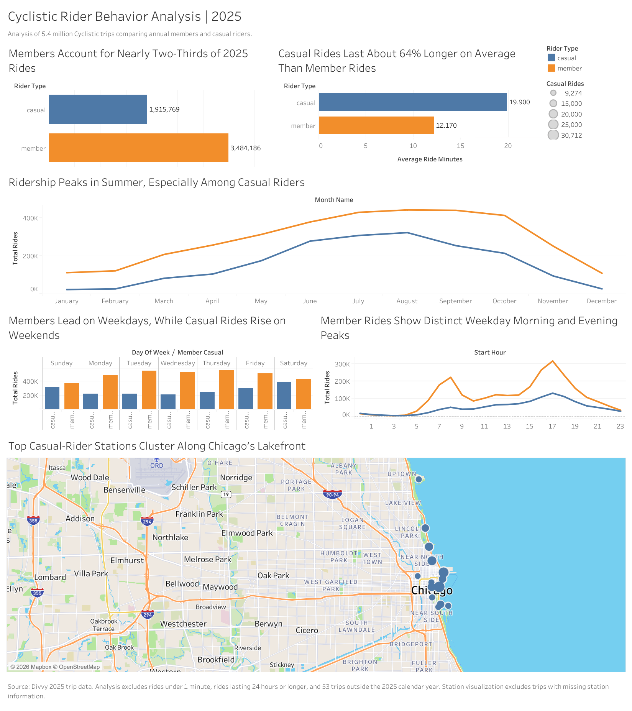

# Cyclistic Bike-Share Analysis

## Project Overview: 
This case study analyzes how casual riders and annual members use Cyclistic bikes differently. The goal is to identify patterns in ride frequency, duration, timing, and location that can help Cyclistic develop marketing strategies for converting casual riders into annual members.

## Business Task: 
Cyclistic’s director of marketing wants to increase the number of annual memberships because annual members are more profitable than casual riders. The business task is to analyze Cyclistic’s historical bike-trip data to determine how casual riders and annual members use the bike-share service differently. The findings will be used to develop three data-driven marketing recommendations aimed at encouraging casual riders to purchase annual memberships.

### Primary Business Question: 
How do annual members and casual riders use Cyclistic bikes differently?

## Key Stakeholders
- Lily Moreno, Director of Marketing
- Cyclistic Marketing Analytics Team
- Cyclistic Executive Team

## Tools
- Google BigQuery:Data storage, cleaning, transformation, and analysis
- Tableau: Data visualization and dashboard development
- GitHub:Project documentation and portfolio presentation

## Interactive Dashboard
Explore the full interactive Tableau dashboard:
[View the Cyclistic Rider Behavior Analysis Dashboard](https://public.tableau.com/app/profile/peace.okei/viz/cyclistic_rider_analysis_2025/CyclisticRiderBehaviorAnalysis2025)

## Dashboard Preview

## Data Preparation and Cleaning

The 12 monthly CSV files were uploaded to Google Cloud Storage and combined into one raw BigQuery table containing **5,552,994 trip records**.

Before analysis, I completed the following quality checks:

- Verified that all `ride_id` values were unique
- Confirmed that `member_casual` contained only `member` and `casual`
- Checked essential fields for null or blank values
- Reviewed missing station and coordinate information
- Investigated negative, zero, unusually short, and unusually long ride durations
- Confirmed the dataset’s date range

### Cleaning Decisions

The cleaned dataset:
- Includes only trips beginning between January 1 and December 31, 2025
- Excludes rides lasting less than one minute
- Excludes rides lasting 24 hours or longer
- Retains trips with missing station information because they remain useful for time, duration, bike-type, and rider-group analysis
- Excludes missing station records only from station-specific visualizations
After cleaning, the final analysis table contained **5,399,955 unique rides**.

Additional calculated fields included:
- Ride length in seconds and minutes
- Ride date
- Day of the week
- Weekday or weekend classification
- Month name and number
- Starting hour
